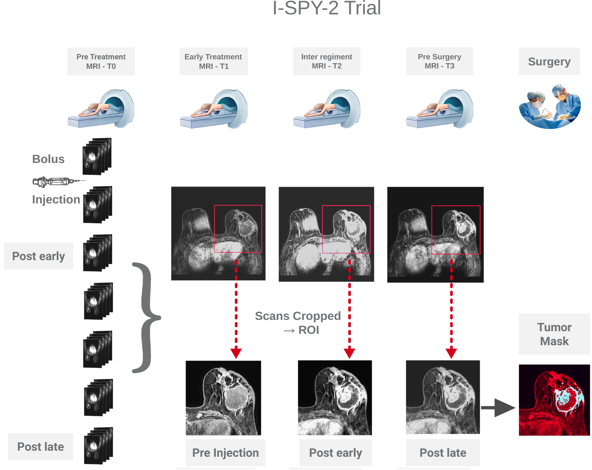

# BreastDCEDL
BreastDCEDL A Deep Learning-Ready DCE-MRI Breast Cancer Dataset from I-SPY 2 with DCE-MRI Processing Toolkit

## I-SPY-2 dataset

Notebook to view I-SPY-2 data samples

The public Breast DCE- MRI dataset entitled I-SPY 2 trial (Li et al., 2022; Newitt et al., 2021) ,comprises DCE-MRI data from 982 patients, acquired during the period from 2010 to 2016 across more than 22 clinical centers, all following a standardized image acquisition protocol.
 For each patient, the dataset encompasses MRI examinations at four distinct time points: pre-treatment (T0) and three subsequent MRI sessions conducted during and after the course of Neoadjuvant Chemotherapy (NAC). For our study's purposes, we exclusively utilized the pre-treatment MRI scans. Furthermore, the dataset includes derived maps and segmentations generated from the DCE acquisitions. Each patient's record is enriched with histopathologic information, encompassing post-treatment functional tumor volume, pathological complete response (pCR) status, hormone receptor (HR) status, human epidermal growth factor receptor 2 (HER2) status (categorized as positive or negative), MammaPrint (MP) risk level, and patient’s age at screening. Remarkably, 313 patients, constituting 32% of the cohort, achieved a pCR in response to NAC.
From a clinical perspective, the cohort demonstrates important molecular subtype distributions: 54.5% (n=537) of patients are Hormone Receptor-positive (HR+), and 24.8% (n=244) are HER2-positive. The pathologic complete response (pCR) rate, a crucial measure of treatment effectiveness, was observed in 32.2% (n=317) of patients. 

MRI Breast image from Breast MRI - Mayo Clinic https://www.mayoclinic.org/tests-procedures/breast-mri/about/pac-20384809

Monticciolo, D. L., Newell, M. S., Moy, L., Niell, B., Monsees, B., & Sickles, E. A. (2018). Breast Cancer Screening in Women at Higher-Than-Average Risk: Recommendations From the ACR. Journal of the American College of Radiology, 15(3), 408–414. https://doi.org/10.1016/j.jacr.2017.11.034
QuantumLeap Healthcare Collaborative. (2024). I-SPY Trial (Investigation of Serial Studies to Predict Your Therapeutic Response With Imaging And moLecular Analysis 2) (Clinical Trial Registration No. NCT01042379). clinicaltrials.gov. https://clinicaltrials.gov/study/NCT01042379
